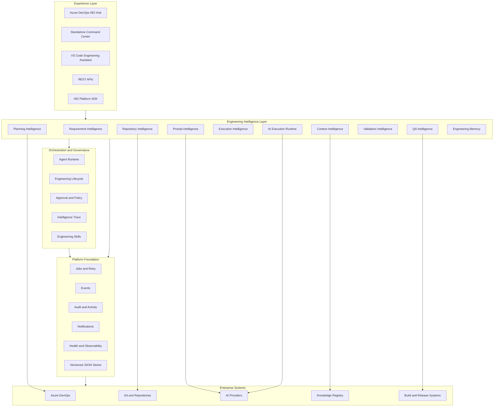
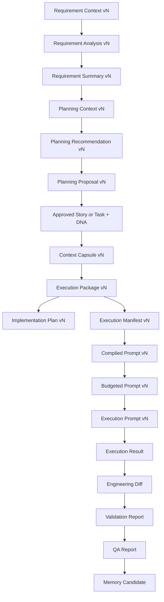
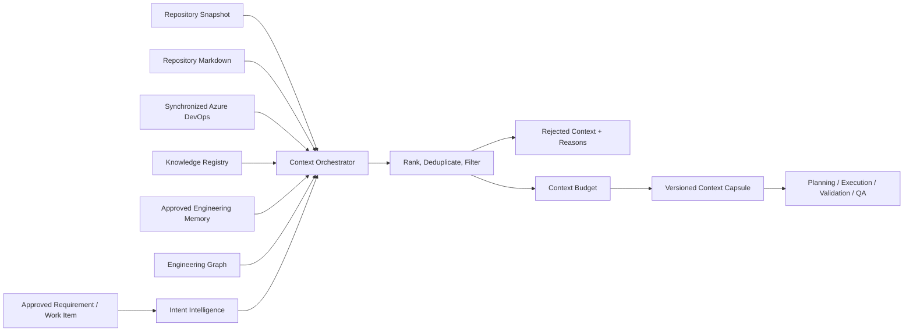
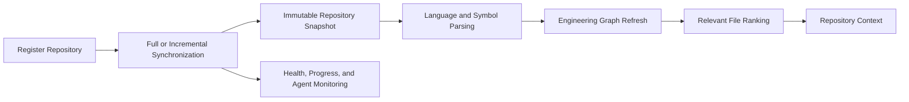
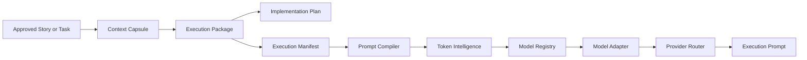
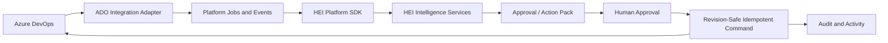
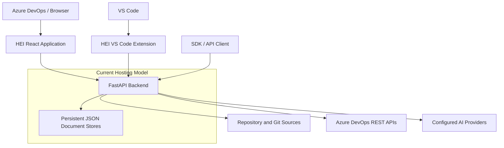
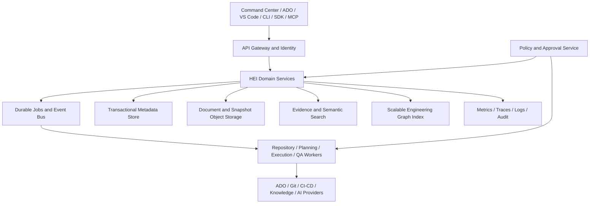

# HEI Application Implementation, Scope, Architecture, and Roadmap

## Document Purpose

This document provides a complete application-level view of the HEI Engineering
Platform. It explains:

- the product purpose and scope;
- the implemented application capabilities;
- the architecture and module boundaries;
- the engineering lifecycle and artifact lineage;
- the user experiences and external integrations;
- current implementation constraints; and
- the planned path from the current platform to an enterprise Engineering
  Operating System.

Detailed subsystem specifications remain in the linked architecture,
integration, platform, testing, and operations documents. This document is the
recommended starting point for engineering leaders, architects, developers,
product owners, and delivery teams.

## Executive Summary

HEI is a repository-aware Engineering Intelligence Platform. It transforms
approved business intent and verified engineering evidence into traceable
planning, implementation, validation, QA, and release artifacts.

HEI does not replace Azure DevOps, Git, repositories, CI/CD systems, or coding
assistants. It connects them through governed, versioned engineering context.

The product promise is:

> Move from a requirement to implementation-ready engineering work without
> repeatedly reconstructing intent, repository context, standards, risks, and
> validation expectations.

The platform is designed around five principles:

1. Engineering facts precede AI reasoning.
2. Context is selected once and consumed through versioned artifacts.
3. Deterministic outputs remain usable when an AI provider is unavailable.
4. Humans approve consequential planning and automation actions.
5. Every decision retains evidence, lineage, confidence, and audit history.

## Product Scope

### In Scope

HEI currently addresses the following engineering lifecycle areas:

- requirement ingestion from text, documents, transcripts, and Azure DevOps;
- AI-assisted requirement refinement with deterministic fallback;
- statement-level reasoning governance and evidence provenance;
- repository registration, synchronization, snapshots, parsing, graph data,
  file ranking, and monitoring;
- Engineering Intelligence across repository, Markdown, Azure DevOps,
  Knowledge Registry, and approved Engineering Memory;
- planning context, recommendations, proposals, estimates, dependencies,
  reviews, approvals, and Azure DevOps previews;
- deterministic Context Capsules, Execution Packages, Implementation Plans,
  and Execution Manifests;
- model-aware prompt compilation, token budgeting, adaptation, routing,
  caching, and diagnostics;
- execution-session recording, response interpretation, semantic engineering
  diff, validation and QA trigger decisions, memory candidates, and PR
  candidates;
- implementation validation, PR intelligence, QA readiness, regression risk,
  and release recommendations;
- Engineering Memory candidate review, approval, versioning, and retrieval;
- Azure DevOps synchronization, work-item intelligence, approved automation,
  PR intelligence, estimation, sprint intelligence, and agent preparation;
- platform jobs, events, audit, activity, notifications, health, policies,
  observability, and approval checkpoints; and
- Engineering Command Center, Azure DevOps hub, VS Code assistant, APIs, and
  Platform SDK contracts.

### Explicitly Out of Scope

HEI does not currently:

- autonomously merge pull requests;
- deploy software;
- approve its own planning, release, or Azure DevOps write actions;
- modify a repository directly from the Execution Runtime;
- invent repository files, APIs, services, or work items when evidence is
  unavailable;
- replace Azure DevOps as the system of record;
- use developer-surveillance metrics such as lines of code or keyboard time;
- require an external graph database for the current implementation; or
- treat unapproved AI suggestions as official requirements.

## Users and Outcomes

| User | Primary outcome |
| --- | --- |
| Product Owner / Business Analyst | Convert incomplete source material into a reviewable engineering requirement. |
| Engineering Manager | Understand scope, reuse, risk, dependencies, estimates, and readiness before approval. |
| Architect / Technical Lead | Review repository impact, architecture evidence, constraints, and implementation strategy. |
| Developer | Receive a bounded Implementation Package, plan, and provider-ready Execution Prompt. |
| QA Engineer | Evaluate acceptance coverage, test gaps, regression risk, and release readiness. |
| Scrum Master / Delivery Lead | Understand sprint flow, blockers, carryover, review bottlenecks, and forecast confidence. |
| Platform Administrator | Configure repositories, Azure DevOps, providers, agents, policies, diagnostics, and feature flags. |

## Platform Architecture



### Architectural Direction

The application is currently delivered as a modular FastAPI backend with
domain-oriented Python packages, React-based Azure DevOps experiences, and a
TypeScript VS Code extension. The modules are separated by contracts even when
they run in the same backend process.

This modular-monolith approach keeps local development and deployment simple
while preserving boundaries for future service extraction.

## Application Components

### Experience Layer

| Component | Implementation | Purpose |
| --- | --- | --- |
| Engineering Command Center | Shared React application in the Azure DevOps extension | Operational workspace for Overview, Requirements, Planning, Repository, Execution, Approvals, Azure DevOps, Agents, Activity, Health, and Administration. |
| Azure DevOps work-item contributions | Azure DevOps extension entry points | Open HEI in context of an Epic, Feature, Story, Task, repository, sprint, or PR. |
| VS Code Engineering Assistant | TypeScript VS Code extension | Continue from HEI into a repository-aware implementation workspace and copy/open the generated Execution Prompt. |
| Standalone host | Shared host-adapter contract | Runs the same HEI application outside Azure DevOps where configured. |
| HEI Platform SDK | Transport-independent service contracts | Gives clients one programming model while REST routes remain an implementation detail. |
| Backend APIs | FastAPI routers | Expose versioned domain operations, diagnostics, and read models. |

### Intelligence Layer

| Capability | Current responsibility |
| --- | --- |
| Requirement Intelligence | Ingestion, parsing, refinement, analysis, repository detection, governance, Acceptance Criteria, and reviewed Requirement Summary. |
| Engineering Intelligence | Shared evidence orchestration across repository, Markdown, ADO, memory, knowledge, architecture, dependencies, and similar work. |
| Planning Intelligence | Context, strategy recommendation, proposal hierarchy, estimates, dependencies, validation, review, approval, and synchronization preview. |
| Repository Intelligence | Repository registration, full/incremental synchronization, snapshots, metadata parsing, symbols, graph relationships, ranking, health, and agents. |
| Context Intelligence | Source retrieval, ranking, rejection, deduplication, freshness, token allocation, and Context Capsule creation. |
| Execution Intelligence | Execution Package, Implementation Plan, execution readiness, standards, risk, and test expectations. |
| Prompt Intelligence | Execution Manifest, compilation, token budgeting, model profile, model adapter, optimization, routing, caching, and diagnostics. |
| AI Execution Runtime | Execution sessions, response interpretation, semantic diff, recovery, traces, and downstream trigger preparation. |
| Validation Intelligence | Acceptance, scope, repository, standards, test, and implementation-alignment validation. |
| QA Intelligence | Acceptance coverage, test generation, gap analysis, regression, risk, readiness, and release recommendation. |
| Engineering Memory | Approved patterns, decisions, lessons, architecture knowledge, execution history, and QA history. |

### Orchestration and Governance

| Capability | Rule |
| --- | --- |
| Engineering Lifecycle Manager | Owns valid state transitions, progress, next actions, blockers, and history. |
| Agent Runtime | Responds to events and prepares work; it never auto-approves consequential actions. |
| Engineering Skills | Encapsulates reusable engineering operations discoverable by agents. |
| Governance | Enforces policies, approvals, compliance, metrics, feedback, observability, and scorecards. |
| Intelligence Trace | Records why an artifact, module, file, memory item, or recommendation was selected or rejected. |
| Approval Center | Provides one consistent approval experience across planning, execution, memory, ADO action packs, PR comments, and exceptions. |

### Platform Foundation

Platform Foundation supplies operational capabilities without making domain
decisions:

- queued and retryable jobs;
- platform and domain events;
- immutable audit records;
- human-readable activity;
- notifications;
- health and diagnostics;
- policy decisions;
- correlation IDs; and
- JSON-backed persistence abstractions.

## End-to-End Engineering Lifecycle

```mermaid
flowchart LR
    Source["Requirement Source"] --> Ingest["Requirement Ingestion"]
    Ingest --> Refine["Requirement Refinement"]
    Refine --> Discover["Engineering Discovery"]
    Discover --> Govern["Reasoning Governance"]
    Govern --> Summary["Approved Requirement Summary"]
    Summary --> PContext["Planning Context"]
    PContext --> Recommend["Planning Recommendation"]
    Recommend --> Proposal["Planning Proposal"]
    Proposal --> Review["Engineering Review"]
    Review --> Approved["Approved Planning Artifact"]
    Approved --> Capsule["Context Capsule"]
    Capsule --> Package["Execution Package"]
    Package --> Plan["Implementation Plan"]
    Package --> Manifest["Execution Manifest"]
    Manifest --> Prompt["Execution Prompt"]
    Prompt --> Implement["Developer / Coding Assistant"]
    Implement --> Runtime["Execution Runtime"]
    Runtime --> Validate["Implementation Validation"]
    Validate --> QA["QA Intelligence"]
    QA --> PR["PR Intelligence"]
    PR --> Release["Release Decision"]
    Release --> Memory["Approved Engineering Memory"]
```



### Human Approval Boundaries

Human approval is mandatory before:

- a Planning Proposal becomes an approved engineering artifact;
- Azure DevOps work items or fields are created or updated;
- an AI suggestion becomes official requirement scope;
- a PR intelligence comment is posted unless an explicit policy permits it;
- a Memory Candidate becomes available Engineering Memory; and
- a release recommendation is treated as an approved release decision.

Agents may prepare these actions, but they cannot approve them.

## Canonical Artifact Lineage



Each artifact records the relevant requirement, planning, DNA, repository
snapshot, knowledge, memory, model, prompt, and correlation versions. A
downstream consumer must not reconstruct broad context independently.

## Context and Evidence Architecture



### Evidence Authority

- Repository Intelligence is authoritative for current files, modules,
  symbols, services, APIs, tests, and graph relationships.
- Repository Markdown is authoritative only for the selected document content
  and its repository revision.
- Azure DevOps remains authoritative for work-item, sprint, PR, and build
  state.
- Knowledge Registry supplies approved project standards and bounded domain
  knowledge.
- Engineering Memory supplies approved historical evidence and never overrides
  current repository facts.
- AI providers reason over selected context; they are not engineering fact
  sources.

## Requirement Intelligence and AI Governance

Every requirement enters through Requirement Ingestion. Planning does not
receive raw text directly.

Requirement Analysis separates each generated statement into:

- `SOURCE`;
- `EVIDENCE`;
- `AI_INFERRED`;
- `AI_SUGGESTION`; or
- `UNKNOWN`.

Unsupported model additions such as rollback, retry, authentication, audit,
notifications, role management, or CRUD behavior are retained as suggestions
unless the source or verified engineering evidence supports them. Acceptance
Criteria generation consumes governed scope only.

See [AI Reasoning Governance](./01-Architecture/AI%20Reasoning%20Governance.md).

## Planning Architecture

Planning is a reviewable sequence rather than a single generation request:

1. Requirement Summary approval.
2. Planning Context construction.
3. Similar-work and repository-reuse analysis.
4. Planning classification and impact analysis.
5. Primary recommendation and alternatives.
6. Editable Planning Proposal with Epic, Features, Stories, Tasks, Acceptance
   Criteria, estimates, dependencies, risks, and repository mappings.
7. Planning Diff against synchronized Azure DevOps artifacts.
8. Multi-section engineering review and approval.
9. Azure DevOps dry-run and approved synchronization.

The Planning Proposal is versioned. Editing an approved proposal creates a new
version and invalidates previous approvals.

## Repository Intelligence Architecture

Repository Intelligence uses an in-memory and JSON-persisted graph and snapshot
model. It does not require Neo4j, Cosmos Gremlin, Memgraph, or another external
graph database.



Every completed synchronization creates a versioned snapshot. Incremental
synchronization applies added, modified, deleted, and renamed metadata changes
without rescanning the full repository. Context Capsules and Execution Packages
record the snapshot version they consumed.

## Execution and Prompt Architecture

Execution is deterministic before it becomes model-specific:



- The Execution Package is structured engineering context, not a prompt.
- The Implementation Plan explains how the package should be implemented.
- The Execution Manifest is immutable and model-independent.
- Prompt Compiler creates deterministic sections.
- Token Intelligence preserves protected engineering evidence while fitting a
  provider budget.
- Model Adapters render model-family-specific wording without invoking a
  provider.
- Provider Router selects a model and records the routing reason.

## Execution Runtime, Validation, and QA

The Execution Runtime records and interprets AI provider outcomes. It does not
write to repositories.

Its pipeline includes:

- execution session lifecycle;
- raw response registration;
- provider-response normalization;
- engineering artifact extraction;
- semantic Engineering Diff;
- validation trigger decision;
- QA trigger plan;
- Memory Candidate generation;
- PR Candidate generation;
- retries, resume, cancellation, timeout, and idempotency; and
- correlation traces and diagnostics.

Implementation Validation checks planned versus actual changes. QA
Intelligence answers whether the implementation is ready for release rather
than merely generating test cases.

## Azure DevOps Integration

Azure DevOps remains the system of record.



Read and write permissions are separated. Writes require preview, approval,
permission, source-revision validation, idempotency, and audit. Arbitrary patch
routes are not part of the approved automation contract.

## Deployment Topology



### Current Technology Stack

- Python and FastAPI backend;
- Pydantic-compatible API contracts;
- JSON document stores behind repository abstractions;
- React 18 and TypeScript Azure DevOps extension;
- TypeScript VS Code extension;
- Webpack extension build;
- Azure DevOps Extension SDK and API;
- optional Azure AI Foundry Phi and pluggable reasoning providers; and
- Railway-compatible Uvicorn deployment.

## Current Implementation Status

The following status terms are used:

- **Integrated:** connected to the active user workflow and shared contracts.
- **Implemented:** module, APIs, persistence, and regression tests exist, but
  operational rollout may still require environment configuration.
- **Compatibility:** retained to support earlier workflows during migration.
- **Planned:** architecture or placeholder exists but enterprise rollout is
  future work.

| Area | Status | Notes |
| --- | --- | --- |
| Requirement Intelligence | Integrated | Ingestion, refinement, analysis, governance, repository recommendation, Acceptance Criteria, review, and summary are connected. |
| Planning Context, Recommendation, and Proposal | Integrated | Reviewable planning flow with versioning, diff, approval, and ADO preview. |
| Repository Intelligence | Integrated | Registration, synchronization, snapshots, parsing, graph, ranking, monitoring, and Repository Center are available. |
| Context Capsule and Execution Package | Integrated | Versioned context-first execution contracts are enforced in the new flow. |
| Prompt Intelligence | Implemented | Manifest, compiler, token budget, model registry/adapters, routing, cache, and diagnostics have APIs and tests. |
| AI Execution Runtime | Implemented foundation | Session, interpretation, diff, triggers, candidates, observability, and recovery exist without repository writes. |
| Validation and QA | Integrated | Implementation alignment and release-readiness views are available; external test/build evidence depends on connected systems. |
| Engineering Memory | Implemented | Only validated and approved candidates may become available memory. Adoption quality depends on approved historical outcomes. |
| Azure DevOps Integration | Integrated with controls | Read, synchronization, intelligence, preview, approved commands, PR, sprint, agents, and operational validation exist. Live use requires configured permissions and a safe project. |
| Agent and Skills Frameworks | Implemented foundation | Event-driven preparation and policy checkpoints exist; consequential execution remains approval-gated. |
| Governance and Trace | Implemented | Policies, approvals, compliance, metrics, feedback, observability, audit, scorecards, and explainability contracts exist. |
| Engineering Command Center | Integrated | Shared application shell and operational workspaces are available in the HEI Azure DevOps hub. |
| VS Code Assistant | Integrated | Backend resolution, engineering request experience, execution deep links, and prompt handoff are available. |
| Legacy Project Intelligence | Compatibility | Existing profile, knowledge-cache, planning, and artifact APIs remain while consumers migrate to Engineering Intelligence. |

## Security and Governance

The platform applies the following safety model:

- credentials remain in backend secure configuration;
- plaintext PATs are not returned or persisted in public connection models;
- provider calls use bounded, budgeted context;
- prompts containing sensitive data are not logged unless explicitly enabled;
- ADO authorization failures are not blindly retried;
- write actions are revision-protected and idempotent;
- repository evidence is traceable and cannot be fabricated;
- AI suggestions require approval before becoming official scope;
- approved artifacts are immutable and changed through versioning;
- every consequential action carries actor, reason, timestamp, and correlation
  ID; and
- role-aware views restrict administrative diagnostics.

## Observability and Operations

HEI records:

- provider, model, tokens, latency, retries, and fallbacks;
- context sources, rankings, excluded context, and freshness;
- agent trigger, job, status, duration, result, and next action;
- artifact lifecycle and approval history;
- ADO synchronization cursor, counts, failures, and reconciliation;
- runtime session timeline and correlation trace;
- platform health, queue state, persistence, events, and service probes; and
- human-readable activity and immutable audit history.

Command Center hardening exposes isolated health probes so one degraded service
does not make the full workspace unavailable.

## Testing Strategy

The repository contains broad unit, API-contract, regression, hardening, and
integration coverage across the platform. Major test areas include:

- context-first consumer boundaries;
- repository modes and no-fabrication guarantees;
- requirement governance and Acceptance Criteria safety;
- planning versioning and approval gates;
- Azure DevOps synchronization, idempotency, revision protection, and policy;
- prompt budgets, model adapters, routing, cache, and diagnostics;
- execution-runtime lifecycle, recovery, and semantic diff;
- validation, QA, PR, memory, lifecycle, agent, skill, and governance behavior;
- Command Center workspaces, permissions, accessibility contracts, and empty
  states; and
- mocked and opt-in live Azure DevOps operational validation.

Standard verification:

```bash
python3 -m compileall backend tests
python3 -m unittest discover -s tests -v
cd azure-devops-extension && npm run build
cd ../vscode-extension && npm run compile
```

Destructive integration tests must never target a production Azure DevOps
project.

## Current Constraints and Known Limitations

### Persistence

The current backend primarily uses JSON document stores. This is appropriate
for development, demos, deterministic tests, and bounded deployments, but it is
not the final enterprise persistence architecture for high concurrency,
distributed locking, large data volumes, or multi-instance writes.

### Backend Process

Most domain modules run in one FastAPI deployment. Boundaries are logical and
contract-driven rather than independently deployed services. Job execution and
long-running repository synchronization need durable distributed execution for
large-scale production use.

### Compatibility Surface

Legacy `ProjectIntelligenceService`, old prompt names, and selected deprecated
routes remain available. Compatibility wrappers reduce migration risk but also
increase the API and maintenance surface until deprecation is complete.

### Repository Scale

The JSON/in-memory Engineering Graph is intentional for the current stage.
Very large multi-repository organizations will require stronger indexing,
partitioning, incremental retrieval, and storage strategies.

### Provider Variability

AI providers vary in context size, JSON reliability, tool support, latency,
and availability. Deterministic baselines and provider-response normalization
keep workflows usable, but enrichment quality still depends on the configured
provider and available evidence.

### Enterprise Operations

Live Azure DevOps automation, multi-tenant isolation, organization-wide policy,
retention, secrets rotation, disaster recovery, and service-level objectives
require environment-specific operational validation before production rollout.

## Future Plans

### Phase A: Reliability and Contract Consolidation

- complete migration from legacy Project Intelligence generation paths to
  Engineering Intelligence and Reasoning Engine contracts;
- remove remaining raw-context and provider-specific workflow calls;
- formalize schema compatibility and deprecation windows;
- strengthen requirement-statement approval for suggested enhancements;
- make all lifecycle state durable and independently recoverable; and
- keep the complete regression suite green as a release gate.

### Phase B: Enterprise Persistence and Scale

- introduce a production database behind existing repository abstractions;
- add durable queues, distributed locks, idempotency storage, and worker
  processes;
- support multi-instance backend deployment;
- add object storage for documents, diagnostics, and large snapshots;
- improve graph indexing for large repositories without coupling domain code to
  a specific graph database; and
- establish backup, restore, retention, and disaster-recovery procedures.

### Phase C: Repository and Engineering Intelligence Expansion

- deepen language-aware symbol and relationship extraction;
- improve repository-drift, impact, and cross-repository analysis;
- expand architecture-decision and standards discovery;
- add organization-level approved engineering patterns;
- improve semantic search with bounded evidence and source authority; and
- provide portfolio-level capability, dependency, and risk intelligence.

### Phase D: Execution and IDE Integration

- complete bidirectional execution workspace state between HEI and IDEs;
- support additional coding-assistant adapters through Platform SDK contracts;
- connect implementation results and test/build evidence automatically;
- improve execution replay, comparison, and recovery;
- expose governed skills to additional IDEs and MCP-compatible clients; and
- retain human approval for repository changes, PRs, and releases.

### Phase E: Governance, Operations, and Productization

- organization-level policy packs and approval chains;
- enterprise identity, tenant isolation, and least-privilege administration;
- service-level objectives, alerting, capacity management, and cost controls;
- audit export and compliance reporting;
- real-time Command Center notifications;
- richer accessibility, localization, and mobile-responsive experiences; and
- stable public SDK, CLI, and integration certification.

### Phase F: Controlled Autonomous Preparation

- agents prepare more routine planning, execution, QA, and ADO actions from
  events;
- policies determine when informational actions can run without individual
  approval;
- consequential writes, merges, deployment, and release decisions remain
  explicitly governed; and
- feedback and validated outcomes improve Engineering Memory and estimation
  without learning from failed or rejected artifacts.

## Target Enterprise Architecture



The target architecture preserves the current domain contracts. Storage,
transport, and execution infrastructure can evolve without forcing Planning,
Execution, QA, or client applications to reinterpret engineering context.

## Architectural Guardrails

Future implementation must preserve these rules:

1. Planning never receives raw requirement input.
2. Engineering Intelligence owns fact orchestration; Reasoning AI owns
   judgment.
3. Context Intelligence is the context assembly authority.
4. Repository Intelligence is the source of truth for current code evidence.
5. Execution Packages consume Context Capsules rather than broad project
   context.
6. Execution Manifests consume Execution Packages.
7. Prompt Intelligence never independently queries repository or planning data.
8. Validation and QA consume approved execution artifacts rather than
   regenerating planning.
9. Engineering Memory contains only validated and approved knowledge.
10. Agents prepare work and stop at approval boundaries.
11. Azure DevOps writes use preview, approval, revision protection,
    idempotency, and audit.
12. Every engineering decision remains explainable through evidence and
    correlation lineage.

## Related Documentation

- [Product Vision](./00-Vision/Product%20Vision.md)
- [Platform Architecture](./01-Architecture/Platform%20Architecture.md)
- [Module Boundaries](./01-Architecture/Module%20Boundaries.md)
- [Engineering Intelligence Service](./01-Architecture/Engineering%20Intelligence%20Service.md)
- [AI Reasoning Governance](./01-Architecture/AI%20Reasoning%20Governance.md)
- [Requirement Planning Integration](./01-Architecture/Requirement%20Planning%20Integration.md)
- [Repository Intelligence](./01-Architecture/Repository%20Intelligence.md)
- [Context Intelligence](./01-Architecture/Context%20Intelligence.md)
- [Prompt Intelligence](./01-Architecture/Prompt%20Intelligence.md)
- [HEI Platform SDK](./architecture/hei-platform-sdk.md)
- [Azure DevOps Integration](./integrations/azure-devops-integration.md)
- [Platform Hardening](./testing/platform-hardening.md)
- [Command Center UI Guide](./07-Portal/Command%20Center%20UI%20Guide.md)

## Document Maintenance

Update this document when:

- a canonical artifact or lifecycle stage changes;
- a subsystem moves from planned to implemented or integrated;
- a compatibility route is deprecated;
- persistence or deployment architecture changes;
- a new experience surface or enterprise integration is introduced; or
- an architectural guardrail changes through an approved ADR.
